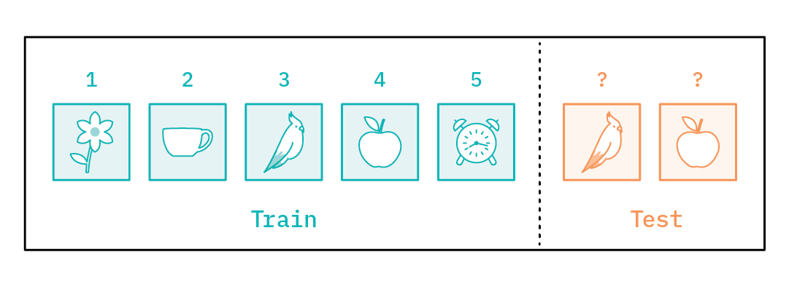
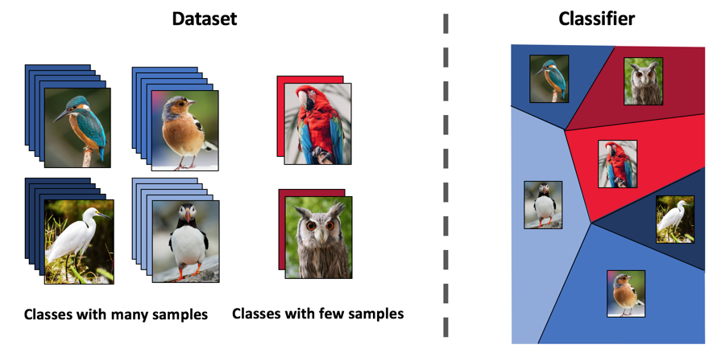

# Tutorials

This section explains **how to use** the Awesome-META+ platform and provides a description of the application scenarios


## Getting Started

Awesome-META+ is a meta-learning software providing four levels of functionality for users.

* Many examples using meta-learning algorithms to train on a myriad of datasets/environments
* A functional interface for several popular meta-learning algorithms as well as a data loader
  to make it easier to import other data sets
* Lots of meta-learning related materials for reaserch and learning: papers, blogs, videos, reports, etc.
* A set of module interfaces for building a meta-learning framework

## Installing

### Plan 1

The services provided by this platform will be able to be installed in the form of python libraries through **pip** after **January 10, 2023**.

```pip install Awesome-META```

### Plan 2

Download from the model port provided in this column:

|                      | Computer Vision | Reinforcement Learning | Optimization | Online |
| :------------------- | :-------------: | :--------------------: | :----------: | :----: |
| MAML                 |        ✅        |           ✅            |      ✅       |   ✅    |
| MetaOptNet           |        ✅        |           ✅            |              |        |
| Reptile              |        ✅        |           ✅            |              |        |
| Prototypical Network |        ✅        |           ✅            |      ✅       |        |
| Relation Network     |        ✅        |           ✅            |      ✅       |        |
| ANIL                 |        ✅        |           ✅            |              |        |
| Meta-SGD             |        ✅        |                        |              |        |
| Meta Dropout         |        ✅        |                        |              |        |
| MT-net               |        ✅        |                        |              |        |
| ES-MAML              |        ✅        |           ✅            |              |        |
| CNAP                 |        ✅        |                        |              |        |
| SNAIL                |        ✅        |                        |              |        |

### plan 3

Use **Git**

1. Create a new folder demo locally as a local code repository.

2. Go to the demo folder, right-click, select git bash here, and open the git bash terminal.
3. Enter the ```git init``` command in the git bash terminal to initialize the local repository.
   ``` git clone https://github.com/WangJingyao07/MetaLearning-Lab.git ```

### !!! tip

​    If you encounter a problem, feel free to an open an [issue](https://github.com/WangJingyao07/MetaLearning-Lab/issues) 
​    and we'll look into it.


## Examples



**Compute support and query embeddings**

~~~python
embeddings = model(data)
  support_indices = np.zeros(data.size(0), dtype=bool)
  selection = np.arange(ways) * (shot + query_num)
  for offset in range(shot):
      support_indices[selection + offset] = True
  query_indices = torch.from_numpy(~support_indices)
  support_indices = torch.from_numpy(support_indices)
  support = embeddings[support_indices]
  support = support.reshape(ways, shot, -1).mean(dim=1)
  query = embeddings[query_indices]
  labels = labels[query_indices].long()

  logits = pairwise_distances_logits(query, support)
  loss = F.cross_entropy(logits, labels)
  acc = accuracy(logits, labels)
  return loss, acc
~~~

</details>


**Create a Model**

~~~python
maml = Ameta.algorithms.MAML(model, lr=0.1)
opt = torch.optim.SGD(maml.parameters(), lr=0.001)
for iteration in range(10):
    opt.zero_grad()
    task_model = maml.clone()  
    adaptation_loss = compute_loss(task_model)
    task_model.adapt(adaptation_loss)  
    evaluation_loss = compute_loss(task_model)
    evaluation_loss.backward()  
    opt.step()
~~~

</details>





## More services

see Documentation for details.

| Service                        | Details                                                      |
| :----------------------------- | :----------------------------------------------------------- |
| **Framework deployment**       | 🎉You can browse the frameworks, models, datasets and other information provided by the platform in the "Home", and then locate them according to their needs through two methods: the first is to directly enter keywords in the search bar above the main interface; the second is to enter the keywords in the "Home" "Interface, click to jump to the corresponding framework to understand the deployment method, and obtain specific details in the "Tutorials" and other modules, and pull the source code of the meta-learning framework and the deployment details to the local for testing with one click. |
| **Learn Meta Learning**        | ✨You can locate "Papers", "Datasets", "Community" and other modules according to their needs, and obtain the platform learning curve, as well as the download links of related blogs, monographs, papers and other resources. |
| **Multi-domain task transfer** | 💖You can understand the platform usage instructions and provide framework information according to the "Tutorials", "Documentation", and "Examples" modules, the framework details and optimization ideas corresponding to tasks in different fields, and actual cases (such as the performance comparison of each framework in small sample image classification, namely ACC). , AP and other indicators), so as to locate the required target and complete the configuration. |
| **Feedback**                   | 🎁Our library is open source for research purposes, and we want to improve it! So let us know (create a new GitHub issue or pull request, email us, etc.) |

