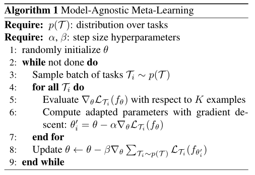
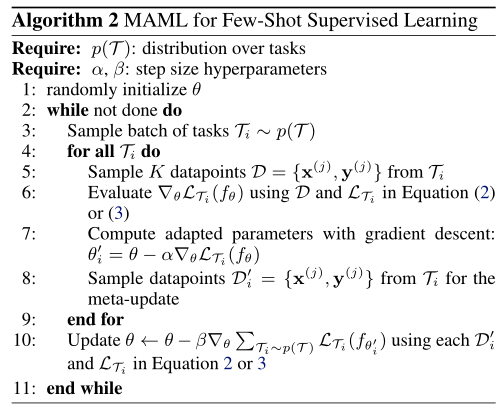
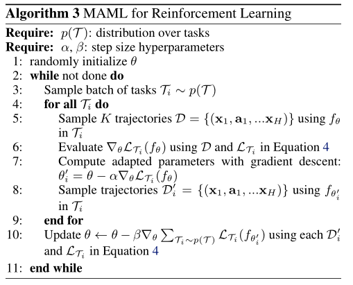
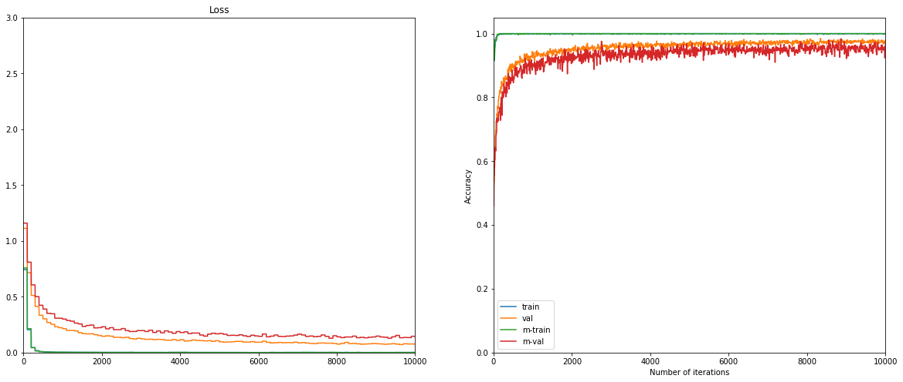

# MAML

Paper: [Model-Agnostic Meta-Learning for Fast Adaptation of Deep Networks (Finn et al., ICML 2017)](https://arxiv.org/abs/1703.03400). It includes code for running the few-shot supervised learning domain experiments, including sinusoid regression, Omniglot classification, and MiniImagenet classification.

For the experiments in the RL domain, see [this codebase](https://github.com/cbfinn/maml_rl).

## Overview [Abstract]

This is an algorithm for meta-learning that is model-agnostic, in the sense that it is compatible with any model trained with gradient descent and applicable to a variety of different learning problems, including classification, regression, and reinforcement learning. The goal of meta-learning is to train a model on a variety of learning tasks, such that it can solve new learning tasks using only a small number of training samples. In our approach, the parameters of the model are explicitly trained such that a small number of gradient steps with a small amount of training data from a new task will produce good generalization performance on that task. In effect, this method trains the model to be easy to fine-tune. The authors demonstrate that this approach leads to state-of-the-art performance on two fewshot image classification benchmarks, produces good results on few-shot regression, and accelerates fine-tuning for policy gradient reinforcement learning with neural network policies.

### For Few-Shot Supervised Learning

### For Reinforcement Learning

### Results

### Dependencies

This code requires the following:
* python 2.\* or python 3.\*
* TensorFlow v1.0+

### Data
For the Omniglot and MiniImagenet data, see the usage instructions in `data/omniglot_resized/resize_images.py` and `data/miniImagenet/proc_images.py` respectively.

### Usage
To run the code, see the usage instructions at the top of `main.py`

We add more datasets, include CIFAR-FS, FC100 etc.

### Contact
"""
Usage Instructions:
    10-shot sinusoid:
        python main.py --datasource=sinusoid --logdir=logs/sine/ --metatrain_iterations=70000 --norm=None --update_batch_size=10

    10-shot sinusoid baselines:
        python main.py --datasource=sinusoid --logdir=logs/sine/ --pretrain_iterations=70000 --metatrain_iterations=0 --norm=None --update_batch_size=10 --baseline=oracle
        python main.py --datasource=sinusoid --logdir=logs/sine/ --pretrain_iterations=70000 --metatrain_iterations=0 --norm=None --update_batch_size=10
    
    5-way, 1-shot omniglot:
        python main.py --datasource=omniglot --metatrain_iterations=60000 --meta_batch_size=32 --update_batch_size=1 --update_lr=0.4 --num_updates=1 --logdir=logs/omniglot5way/
    
    20-way, 1-shot omniglot:
        python main.py --datasource=omniglot --metatrain_iterations=60000 --meta_batch_size=16 --update_batch_size=1 --num_classes=20 --update_lr=0.1 --num_updates=5 --logdir=logs/omniglot20way/
    
    5-way 1-shot mini imagenet:
        python main.py --datasource=miniimagenet --metatrain_iterations=60000 --meta_batch_size=4 --update_batch_size=1 --update_lr=0.01 --num_updates=5 --num_classes=5 --logdir=logs/miniimagenet1shot/ --num_filters=32 --max_pool=True
    
    5-way 5-shot mini imagenet:
        python main.py --datasource=miniimagenet --metatrain_iterations=60000 --meta_batch_size=4 --update_batch_size=5 --update_lr=0.01 --num_updates=5 --num_classes=5 --logdir=logs/miniimagenet5shot/ --num_filters=32 --max_pool=True
    
    To run evaluation, use the '--train=False' flag and the '--test_set=True' flag to use the test set.
    
    For omniglot and miniimagenet training, acquire the dataset online, put it in the correspoding data directory, and see the python script instructions in that directory to preprocess the data.
    
    Note that better sinusoid results can be achieved by using a larger network.
"""

### Colab

[Colab Link](https://colab.research.google.com/drive/1vdF9x1TXkI4wRjWz_oN0v_tknH77od_6)

