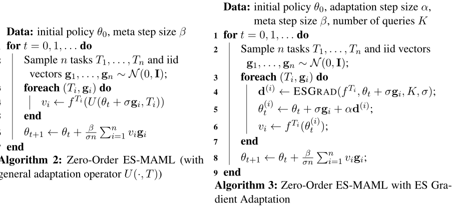
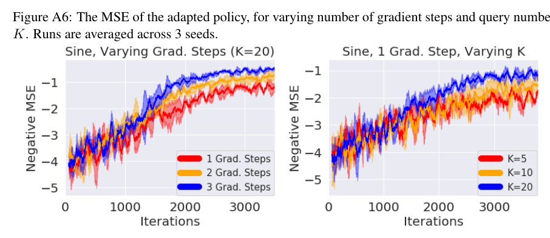

# ES-MAML

Paper:  ["ES-MAML: Simple Hessian-Free Meta Learning"](https://arxiv.org/abs/1910.01215) 

This was also used in ["Rapidly Adaptable Legged Robots via Evolutionary Meta-Learning"](https://arxiv.org/abs/2003.01239) with associated [Google AI Blog Post](https://ai.googleblog.com/2020/04/exploring-evolutionary-meta-learning-in.html).


## Overview[Abstract]

We introduce ES-MAML, a new framework for solving the model agnostic meta learning (MAML) problem based on Evolution Strategies (ES). Existing algorithms for MAML are based on policy gradients, and incur significant difficulties when attempting to estimate second derivatives using backpropagation on stochastic policies. We show how ES can be applied to MAML to obtain an algorithm which avoids the problem of estimating second derivatives, and is also conceptually simple and easy to implement. Moreover, ES-MAML can handle new types of non-smooth adaptation operators, and other techniques for improving performance and estimation of ES methods become applicable. We show empirically that ES-MAML is competitive with existing methods and often yields better adaptation with fewer queries.






## Citation

```
@inproceedings{es_maml,
  author    = {Xingyou Song and
               Wenbo Gao and
               Yuxiang Yang and
               Krzysztof Choromanski and
               Aldo Pacchiano and
               Yunhao Tang},
  title     = {{ES-MAML:} Simple Hessian-Free Meta Learning},
  booktitle = {8th International Conference on Learning Representations, {ICLR} 2020,
               Addis Ababa, Ethiopia, April 26-30, 2020},
  year      = {2020},
  url       = {https://openreview.net/forum?id=S1exA2NtDB},
}

@article{rapidly,
  author    = {Xingyou Song and
               Yuxiang Yang and
               Krzysztof Choromanski and
               Ken Caluwaerts and
               Wenbo Gao and
               Chelsea Finn and
               Jie Tan},
  title     = {Rapidly Adaptable Legged Robots via Evolutionary Meta-Learning},
  booktitle = {International Conference on Intelligent Robots and Systems, {IROS} 2020},
  year      = {2020},
  url       = {https://arxiv.org/abs/2003.01239},
}

```


## Usage

In order to run the algorithm, you must launch both the binaries `es_maml_client` (which produces the central 'aggregator') and multiple launches of `es_maml_server` (which produces the 'workers').

This depends on your particular distributed communication infrastructure, but we by default use GRPC. In order to use the default GRPC method of client-server communication, you must first create the proper `pb2.py` and `pb2_grpc.py` libraries from the `.proto`'s for both `zero_order` and `first_order`. This can be done via the commands (see [discussion](https://github.com/google-research/google-research/issues/499)):

```
$ pip install protobuf
$ pip install grpcio-tools==1.32
$ pip install googleapis-common-protos

$ python -m grpc_tools.protoc --proto_path=. --python_out=. --grpc_python_out=. first_order.proto
$ python -m grpc_tools.protoc --proto_path=. --python_out=. --grpc_python_out=. zero_order.proto
```

### Algorithms

The hyperparameters are all contained in `config.py`.

There are two algorithms:

1.  Zero Order
2.  First Order

**Zero Order**:

1. Uses custom adaptation operators, built using blackbox algorithms such as MCBlackboxOptimizer, DPP sampling, and Hill-Climbing.

2. Collects state normalization data from all workers.

**First Order**:

1.  Uses local-worker state normalization.

2.  Allows Hessian computation.

