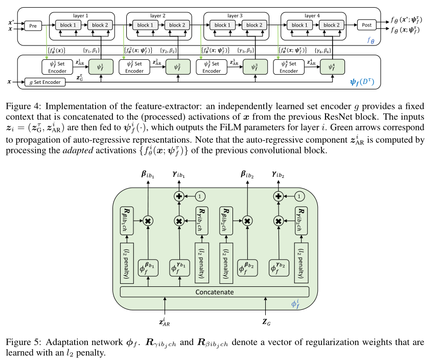
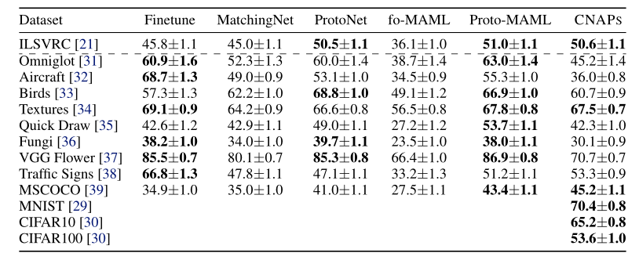

# CNAP
Paper: [Fast and Flexible Multi-Task Classification Using Conditional Neural Adaptive Processes](https://arxiv.org/abs/1906.07697)
and [TASKNORM: Rethinking Batch Normalization for Meta-Learning](https://arxiv.org/pdf/2003.03284.pdf).

The code has been authored by: John Bronskill, Jonathan Gordon, and James Reqeima.


## Overview[Abstract]

The goal of this paper is to design image classification systems that, after an initial multi-task training phase, can automatically adapt to new tasks encountered at test time. We introduce a conditional neural process based approach to the multi-task classification setting for this purpose, and establish connections to the meta-learning and few-shot learning literature. The resulting approach, called CNAPS, comprises a classifier whose parameters are modulated by an adaptation network that takes the current task’s dataset as input. We demonstrate that CNAPS achieves state-of-theart results on the challenging META-DATASET benchmark indicating high-quality transfer-learning. We show that the approach is robust, avoiding both over-fitting in low-shot regimes and under-fitting in high-shot regimes. Timing experiments reveal that CNAPS is computationally efficient at test-time as it does not involve gradient based adaptation. Finally, we show that trained models are immediately deployable to continual learning and active learning where they can outperform existing approaches that do not leverage transfer learning.




## Results
The FiLM + TaskNorm configuration consistently yields the best results and trains in much
less time than the other configurations. A meta-trained FiLM + TaskNorm-i model is included
in the models folder which produced the results shown below. The model was trained for 40,000
iterations on two 16GB GPUs. Note that these results differ from those published in our paper
as they now fix the shuffle buffer bug described in meta-dataset
[issue #54](https://github.com/google-research/meta-dataset/issues/54). In particular, the results
for the Traffic Signs dataset are considerable worse. However, the results for other datasets are
comparable (some slightly better, some slightly worse).

**Model trained on all datasets**

| Dataset       | FiLM + TaskNorm |
| ---           | ---      | 
| ILSVRC        | 50.8±1.1 |
| Omniglot      | 91.7±0.5 |
| Aircraft      | 83.7±0.6 |
| Birds         | 73.6±0.9 |
| Textures      | 59.5±0.7 |
| Quick Draw    | 74.7±0.8 |
| Fungi         | 50.2±1.1 |
| VGG Flower    | 88.9±0.5 |
| Traffic Signs | 56.5±1.1 |
| MSCOCO        | 39.4±1.0 |
| MNIST         | 92.3±0.4 |
| CIFAR10       | 68.5±0.9 |
| CIFAR100      | 56.1±1.1 |



## Citation
If you use this code, please cite our [CNAPs](https://arxiv.org/abs/1906.07697) and [TaskNorm](https://arxiv.org/pdf/2003.03284.pdf) papers:
```
@incollection{requeima2019cnaps,
  title      = {Fast and Flexible Multi-Task Classification using Conditional Neural Adaptive Processes},
  author     = {Requeima, James and Gordon, Jonathan and Bronskill, John and Nowozin, Sebastian and Turner, Richard E},
  booktitle  = {Advances in Neural Information Processing Systems 32},
  editor     = {H. Wallach and H. Larochelle and A. Beygelzimer and F. d\' Alch\'{e}-Buc and E. Fox and R. Garnett},
  pages      = {7957--7968},
  year       = {2019},
  publisher  = {Curran Associates, Inc.},
}

@incollection{bronskill2020tasknorm,
  title     = {TaskNorm: Rethinking Batch Normalization for Meta-Learning},
  author    = {Bronskill, John and Gordon, Jonathan and Requeima, James and Nowozin, Sebastian and Turner, Richard},
  booktitle = {Proceedings of the 37th International Conference on Machine Learning},
  volume    = {119},
  series    = {Proceedings of Machine Learning Research},
  publisher = {PMLR},
  year      = {2020}
}
```


## Dependencies

This code requires the following:

* Python 3.5 or greater
* PyTorch 1.0 or greater
* TensorFlow 1.15 or greater

This code has been recently verified on PyTorch 1.7 and TensorFlow 2.3. 


## GPU Requirements

* To train or test a CNAPs model with auto-regressive FiLM adaptation on Meta-Dataset, 2 GPUs with 16GB or more memory
  are required.
* To train or test a CNAPs model with FiLM only adaptation plus TaskNorm on Meta-Dataset, 2 GPUs with 16GB or more memory
  are required.
* It is not currently possible to run a CNAPs model with auto-regressive FiLM adaptation plus TaskNorm on Meta-Dataset
  (even using 2 GPUs with 16GB of memory). It may be possible (we have not tried) to run this configuration on 2 GPUs with
  24GB of memory.
* The other modes require only a single GPU with at least 16 GB of memory.
* If you want to run any of the modes on a single GPU, you can train on a single dataset with fixed shot and way.
  If shot and way are not too large, this configuration will require a single GPU with less than 16GB of memory.
  An example command line is (though this will not reproduce the meta-dataset results):

```python run_cnaps.py --feature_adaptation film -i 20000 -lr 0.001 --batch_normalization task_norm-i -- dataset omniglot --way 5 --shot 5 --data_path <path to directory containing Meta-Dataset records>```


## Installation

1. Clone or download this repository.
2. Configure Meta-Dataset:
   * Follow the the "User instructions" in the Meta-Dataset repository (https://github.com/google-research/meta-dataset)
     for "Installation" and "Downloading and converting datasets". This will take some time.
3. Install additional test datasets (MNIST, CIFAR10, CIFAR100):
   * Change to the $DATASRC directory: ```cd $DATASRC```
   * Download the MNIST test images: ```wget http://yann.lecun.com/exdb/mnist/t10k-images-idx3-ubyte.gz```
   * Download the MNIST test labels: ```wget http://yann.lecun.com/exdb/mnist/t10k-labels-idx1-ubyte.gz```
   * Download the CIFAR10 dataset: ```wget https://www.cs.toronto.edu/~kriz/cifar-10-python.tar.gz```
   * Extract the CIFAR10 dataset: ```tar -zxvf cifar-10-python.tar.gz```
   * Download the CIFAR100 dataset: ```wget https://www.cs.toronto.edu/~kriz/cifar-100-python.tar.gz```
   * Extract the CIFAR10 dataset: ```tar -zxvf cifar-100-python.tar.gz```
   * Change to the ```cnaps/src``` directory in the repository.
   * Run: ```python prepare_extra_datasets.py```


## Usage

To train and test CNAPs on Meta-Dataset:

1. First run the following two commands.

   ```ulimit -n 50000```

   ```export META_DATASET_ROOT=<root directory of the cloned or downloaded Meta-Dataset repository>```

   Note the above commands need to be run every time you open a new command shell.

2. Execute the ```run_cnaps.py``` script from the ```src``` directory following the instructions at the beginning
   of the file.
