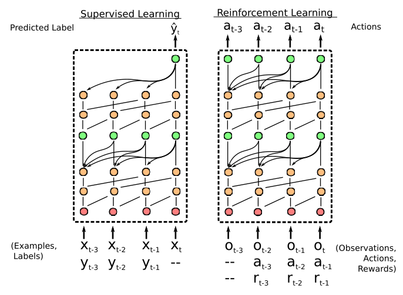

# SNAIL
Paper: An implementation of Simple Neural Attentive Meta-Learner (SNAIL) ([paper](https://arxiv.org/pdf/1707.03141.pdf)) in PyTorch.

Much of the boiler plate code for setting up datasets and what not came from a PyTorch implementation of [Prototypical Networks](https://github.com/orobix/Prototypical-Networks-for-Few-shot-Learning-PyTorch/blob/master/README.md).

## Overview[Abstract]

Deep neural networks excel in regimes with large amounts of data, but tend to struggle when data is scarce or when they need to adapt quickly to changes in the task. In response, recent work in meta-learning proposes training a meta-learner on a distribution of similar tasks, in the hopes of generalization to novel but related tasks by learning a high-level strategy that captures the essence of the problem it is asked to solve. However, many recent meta-learning approaches are extensively hand-designed, either using architectures specialized to a particular application, or hard-coding algorithmic components that constrain how the meta-learner solves the task. We propose a class of simple and generic meta-learner architectures that use a novel combination of temporal convolutions and soft attention; the former to aggregate information from past experience and the latter to pinpoint specific pieces of information. In the most extensive set of meta-learning experiments to date, we evaluate the resulting Simple Neural AttentIve Learner (or SNAIL) on several heavily-benchmarked tasks. On all tasks, in both supervised and reinforcement learning, SNAIL attains state-of-the-art performance by significant margins.

## Results

Below are the following attempts to reproduce the results in the reference
paper:

### Omniglot:

| Model | 1-shot (5-way Acc.) | 5-shot (5-way Acc.) | 1 -shot (20-way Acc.) | 5-shot (20-way Acc.)|
| --- | --- | --- | --- | --- |
| Reference Paper | 99.07% | 99.78% | 97.64% | 99.36%|
| This repo | 98.31%\* | 99.26%\*\* | 93.75%° | 97.88%°° |

## Data

Follow the instructions here: https://github.com/renmengye/few-shot-ssl-public
to download the mini-imagenet dataset.

## Usage

\* achieved running `python train.py --exp omniglot_5way_1shot --cuda`

\* achieved running `python train.py --exp omniglot_5way_5shot --num_samples 5 --cuda`

\* achieved running `python train.py --exp omniglot_20way_1shot --num_cls 20 --cuda`

\* achieved running `python train.py --exp omniglot_20way_5shot --num_cls 20
--num_samples 5 --cuda`

### Mini-Imagenet:

In progress. Writing the code for the experiments should be done soon but the
main bottleneck in these experiments for me is compute, if someone would be
willing to run and report numbers that would be much appreciated.

### RL:

In progress.
