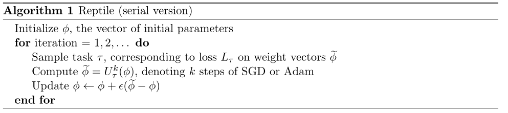

#  Reptile
PyTorch implementation of the supervised learning experiments from the paper:
Reptile: A Scalable Meta-Learning Algorithm: https://blog.openai.com/reptile/
, which is based on Model-Agnostic Meta-Learning (MAML): https://arxiv.org/abs/1703.03400


## Overview [Abstract]

This paper considers meta-learning problems, where there is a distribution of tasks, and obtain an agent that performs well (i.e., learns quickly) when presented with a previously unseen task sampled from this distribution. They analyze a family of algorithms for learning a parameter initialization that can be fine-tuned quickly on a new task, using only firstorder derivatives for the meta-learning updates. This family includes and generalizes first-order MAML, an approximation to MAML obtained by ignoring second-order derivatives. It also includes Reptile, a new algorithm that they introduce here, which works by repeatedly sampling a task, training on it, and moving the initialization towards the trained weights on that task. The authors expand on the results from Finn et al. showing that first-order meta-learning algorithms perform well on some well-established benchmarks for few-shot classification, and they provide theoretical analysis aimed at understanding why these algorithms work.




## Ominiglot

change `dataset = 'omniglot' ` in `main.py` and just run `python main.py`, the program will download omniglot dataset automatically.
modify the value of `meta_batchsz` to fit your GPU memory size.


## Results

| Model                               	| Fine Tune 	| 5-way Acc.    	|               	| 20-way Acc   	|               	|
|-------------------------------------	|-----------	|---------------	|---------------	|--------------	|---------------	|
|                                     	|           	| 1-shot        	| 5-shot        	| 1-shot       	| 5-shot        	|
| MANN                                	| N         	| 82.8%         	| 94.9%         	| -            	| -             	|
| Matching Nets                       	| N         	| 98.1%         	| 98.9%         	| 93.8%        	| 98.5%         	|
| Matching Nets                       	| Y         	| 97.9%         	| 98.7%         	| 93.5%        	| 98.7%         	|
| MAML                                	| Y         	| 98.7+-0.4%    	| 99.9+-0.1%    	| 95.8+-0.3%   	| 98.9+-0.2%    	|
| **This Code**                      | Y         	| 98.62%     		| 99.52%        	| 96.09%   		| 98.24%    				|


>5way 1shot episode: 11580\*512 	finetune acc:0.990234 		test acc:0.986250

>5way 5shot episode: 27180\*128 	finetune acc:0.995625 		test acc:0.995219

>20way 1shot episode: 23160\*128 	finetune acc:0.960937 		test acc:0.960898

>20way 5shot episode: 11580\*32 	finetune acc:0.985938 		test acc:0.982437


## miniImagenet

> train `mini-imagenet` is extremely slow, since the code train task one by one squentially.

download `mini-imagenet` dataset and make it looks like:
```shell
mini-imagenet/
├── images
	├── n0210891500001298.jpg  
	├── n0287152500001298.jpg 
	...
├── test.csv
├── val.csv
└── train.csv

MAML-Pytorch/
├── main.py
├── meta.py
├── Readme.md 
├── naive.md
    ...  
```

change `dataset = 'mini-imagenet' ` in `main.py` and just run `python main.py`.


## Results

| Model                               | Fine Tune | 5-way Acc. |        | 20-way Acc |        |
|-------------------------------------|-----------|------------|--------|------------|--------|
|                                     |           | 1-shot     | 5-shot | 1-shot     | 5-shot |
| Matching Nets                       | N         | 43.56%     | 55.31% | 17.31%     | 22.69% |
| Meta-LSTM                           |           | 43.44%     | 60.60% | 16.70%     | 26.06% |
| MAML                                | Y         | 48.7%      | 63.11% | 16.49%     | 19.29% |
| **Ours**                            | Y         | -      		| - 		| -    		 | - 	|

