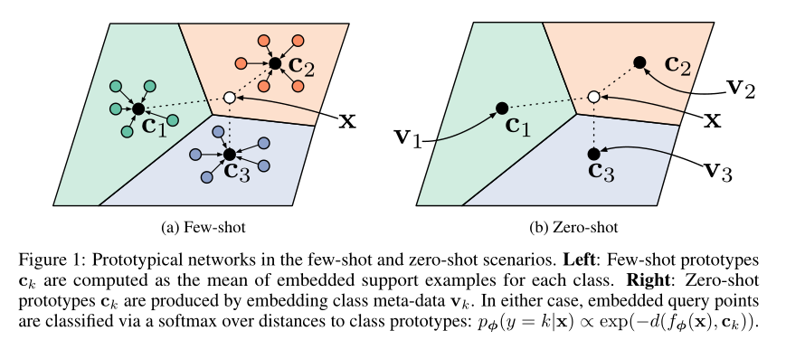
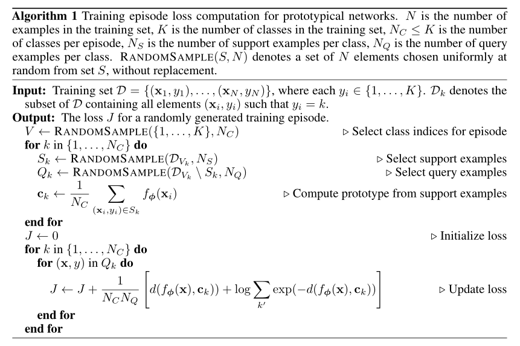
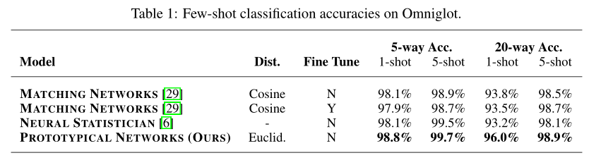
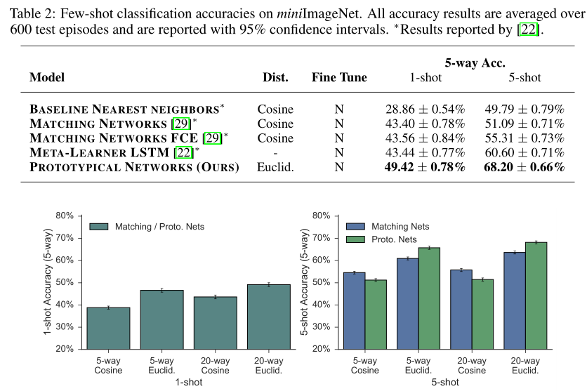

# Prototypical Network

Paper [Prototypical Networks for Few-shot Learning](http://papers.nips.cc/paper/6996-prototypical-networks-for-few-shot-learning.pdf).


## Overview [Abstract]

This paper propose prototypical networks for the problem of few-shot classification, where a classifier must generalize to new classes not seen in the training set, given only a small number of examples of each new class. Prototypical networks learn a metric space in which classification can be performed by computing distances to prototype representations of each class. Compared to recent approaches for few-shot learning, they reflect a simpler inductive bias that is beneficial in this limited-data regime, and achieve excellent results. This paper provide an analysis showing that some simple design decisions can yield substantial improvements over recent approaches involving complicated architectural choices and meta-learning. The authors further extend prototypical networks to zero-shot learning and achieve state-of-theart results on the CU-Birds dataset.






## Results







## Citation

```
@inproceedings{snell2017prototypical,
  title={Prototypical Networks for Few-shot Learning},
  author={Snell, Jake and Swersky, Kevin and Zemel, Richard},
  booktitle={Advances in Neural Information Processing Systems},
  year={2017}
 }
```


## Training a prototypical network

### Install dependencies

* This code has been tested on Ubuntu 16.04 with Python 3.6 and PyTorch 0.4.
* Install [PyTorch and torchvision](http://pytorch.org/).
* Install [torchnet](https://github.com/pytorch/tnt) by running `pip install git+https://github.com/pytorch/tnt.git@master`.
* Install the protonets package by running `python setup.py install` or `python setup.py develop`.


### Set up the Omniglot dataset

* Run `sh download_omniglot.sh`.


### Train the model

* Run `python scripts/train/few_shot/run_train.py`. This will run training and place the results into `results`.
  * You can specify a different output directory by passing in the option `--log.exp_dir EXP_DIR`, where `EXP_DIR` is your desired output directory.
  * If you are running on a GPU you can pass in the option `--data.cuda`.
* Re-run in trainval mode `python scripts/train/few_shot/run_trainval.py`. This will save your model into `results/trainval` by default.


### Evaluate

* Run evaluation as: `python scripts/predict/few_shot/run_eval.py --model.model_path results/trainval/best_model.pt`.
