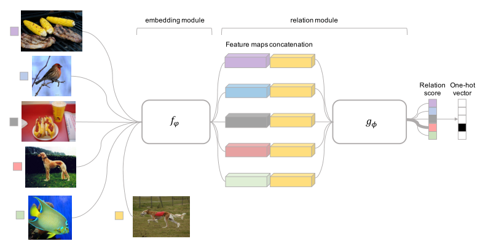
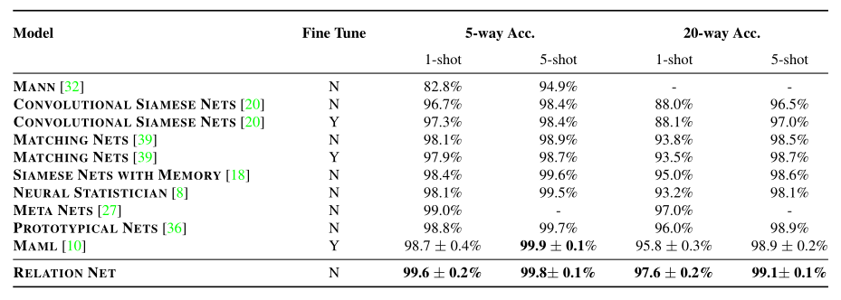

# Relation Network

Paper: [Learning to Compare: Relation Network for Few-Shot Learning](https://arxiv.org/abs/1711.06025) (Few-Shot Learning part)

For Zero-Shot Learning part, please visit [here](https://github.com/lzrobots/LearningToCompare_ZSL).


## Overview [Abstract]

We present a conceptually simple, flexible, and general framework for few-shot learning, where a classifier must learn to recognise new classes given only few examples from each. Our method, called the Relation Network (RN), is trained end-to-end from scratch. During meta-learning, it learns to learn a deep distance metric to compare a small number of images within episodes, each of which is designed to simulate the few-shot setting. Once trained, a RN is able to classify images of new classes by computing relation scores between query images and the few examples of each new class without further updating the network. Besides providing improved performance on few-shot learning, our framework is easily extended to zero-shot learning. Extensive experiments on five benchmarks demonstrate that our simple approach provides a unified and effective approach for both of these two tasks.




## Results

### Omniglot



### miniimagenet


## Citation

If you use this code in your research, please use the following BibTeX entry.

```
@inproceedings{sung2018learning,
  title={Learning to Compare: Relation Network for Few-Shot Learning},
  author={Sung, Flood and Yang, Yongxin and Zhang, Li and Xiang, Tao and Torr, Philip HS and Hospedales, Timothy M},
  booktitle={Proceedings of the IEEE Conference on Computer Vision and Pattern Recognition},
  year={2018}
}
```


## Reference

[MAML](https://github.com/cbfinn/maml)

[MAML-pytorch](https://github.com/katerakelly/pytorch-maml)


## Requirements

Python 2.7

Pytorch 0.3


##Data

For Omniglot experiments, I directly attach omniglot 28x28 resized images in the git, which is created based on [omniglot](https://github.com/brendenlake/omniglot) and [maml](https://github.com/cbfinn/maml).

For mini-Imagenet experiments, please download [mini-Imagenet](https://drive.google.com/open?id=0B3Irx3uQNoBMQ1FlNXJsZUdYWEE) and put it in ./datas/mini-Imagenet and run proc_image.py to preprocess generate train/val/test datasets. (This process method is based on [maml](https://github.com/cbfinn/maml)).


## Train

omniglot 5way 1 shot:

```
python omniglot_train_one_shot.py -w 5 -s 1 -b 19 
```

omniglot 5way 5 shot:

```
python omniglot_train_few_shot.py -w 5 -s 5 -b 15 
```

omniglot 20way 1 shot:

```
python omniglot_train_one_shot.py -w 20 -s 1 -b 10
```

omniglot 20way 5 shot:

```
python omniglot_train_few_shot.py -w 20 -s 5 -b 5
```

mini-Imagenet 5 way 1 shot:

```
python miniimagenet_train_one_shot.py -w 5 -s 1 -b 15
```

mini-Imagenet 5 way 5 shot:

```
python miniimagenet_train_few_shot.py -w 5 -s 5 -b 10
```

you can change -b parameter based on your GPU memory. Currently It will load my trained model, if you want to train from scratch, you can delete models by yourself.


## Test

omniglot 5way 1 shot:

```
python omniglot_test_one_shot.py -w 5 -s 1
```

Other experiments' testings are similar.

