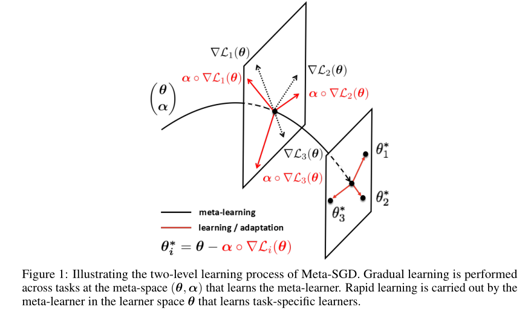
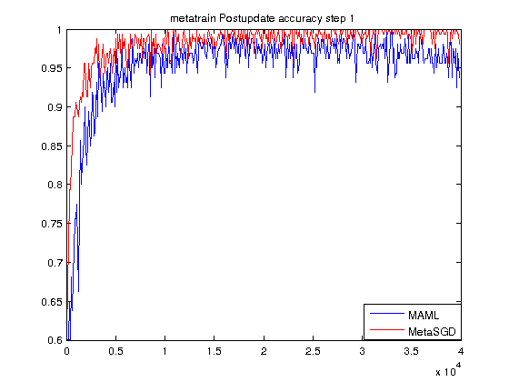
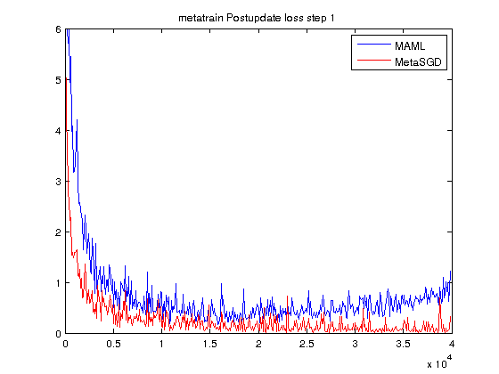
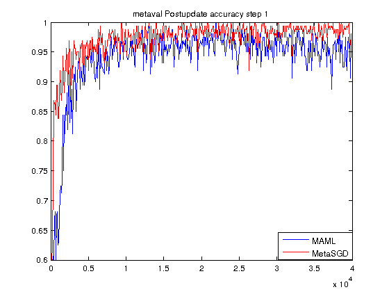
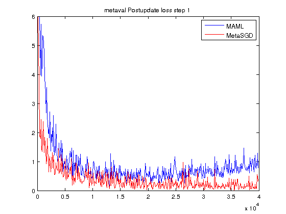
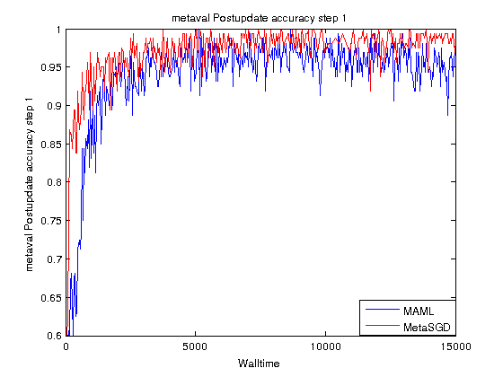

# Meta-SGD

Paper: [Meta-SGD: Learning to Learn Quickly for Few Shot Learning(Zhenguo Li et al.)](https://arxiv.org/abs/1707.09835)) 


## Overview[Abstract]

An important research direction in machine learning has centered around developing meta-learning algorithms to tackle few-shot learning. An especially successful algorithm has been Model Agnostic Meta-Learning (MAML), a method that consists of two optimization loops, with the outer loop finding a meta-initialization, from which the inner loop can efficiently learn new tasks. Despite MAML's popularity, a fundamental open question remains -- is the effectiveness of MAML due to the meta-initialization being primed for rapid learning (large, efficient changes in the representations) or due to feature reuse, with the meta initialization already containing high quality features? We investigate this question, via ablation studies and analysis of the latent representations, finding that feature reuse is the dominant factor. This leads to the ANIL (Almost No Inner Loop) algorithm, a simplification of MAML where we remove the inner loop for all but the (task-specific) head of a MAML-trained network. ANIL matches MAML's performance on benchmark few-shot image classification and RL and offers computational improvements over MAML. We further study the precise contributions of the head and body of the network, showing that performance on the test tasks is entirely determined by the quality of the learned features, and we can remove even the head of the network (the NIL algorithm). We conclude with a discussion of the rapid learning vs feature reuse question for meta-learning algorithms more broadly.




## Results

all the x label in the figure is iteration step.









considering the time cost other than the iteration step:


- we can see that the convergence speed and performance of metaSGD is better than MAML
- the result in both iteration and time scale is the same
- other than MAML, performance of meta-SGD won't get worst in long-term training.


## Usage

```
python main.py --datasource=omniglot --metatrain_iterations=40000 --meta_batch_size=32 --update_batch_size=1 --update_lr=0.4 --num_updates=1 --logdir=logs/omniglot5way/

```

```
python main.py --datasource=omniglot --metatrain_iterations=40000 --meta_batch_size=32 --update_batch_size=1 --update_lr=0.4 --num_updates=1 --logdir=logs/omniglot5way/  --train=False --test_set=True

```

## 