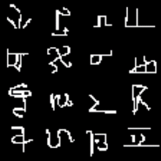
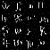
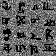
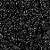
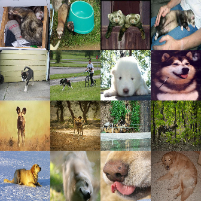
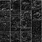
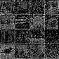
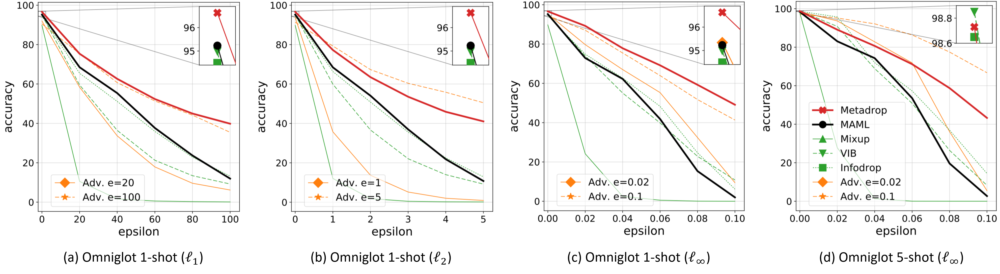

# Meta Dropout
Paper: [Learning to Perturb Latent Features for Generalization](https://openreview.net/forum?id=BJgd81SYwr).

You can reproduce the results of Table 1 in the main paper.

## Abstract
A machine learning model that generalizes well should obtain low errors on unseen test examples. Thus, if we know how to optimally perturb training examples to account for test examples, we may achieve better generalization performance. However, obtaining such perturbation is not possible in standard machine learning frameworks as the distribution of the test data is unknown. To tackle this challenge, we propose a novel regularization method, meta-dropout, which learns to perturb the latent features of training examples for generalization in a meta-learning framework. Specifically, we meta-learn a noise generator which outputs a multiplicative noise distribution for latent features, to obtain low errors on the test instances in an input-dependent manner. Then, the learned noise generator can perturb the training examples of unseen tasks at the meta-test time for improved generalization. We validate our method on few-shot classification datasets, whose results show that it significantly improves the generalization performance of the base model, and largely outperforms existing regularization methods such as information bottleneck, manifold mixup, and information dropout.


## Results

The results in the main paper (average over 1000 episodes, with a single run):

|              | Omni. 1shot    | Omni. 5shot    | mImg. 1shot    | mImg. 5shot    |
| ------------ | -------------- | -------------- | -------------- | -------------- |
| MAML         | 95.23±0.17     | 98.38±0.07     | 49.58±0.65     | 64.55±0.52     |
| Meta-dropout | __96.63±0.13__ | __98.73±0.06__ | __51.93±0.67__ | __67.42±0.52__ |

The results from running this repo (average over 1000 episodes, with a single run):

|              | Omni. 1shot    | Omni. 5shot    | mImg. 1shot    | mImg. 5shot    |
| ------------ | -------------- | -------------- | -------------- | -------------- |
| MAML         | 94.49±0.16     | 98.14±0.07     | 48.73±0.64     | 65.70±0.52     |
| Meta-dropout | __96.24±0.14__ | __98.81±0.06__ | __51.67±0.64__ | __68.12±0.53__ |

### Omniglot

 


### miniImageNet

 

&nbsp;

### Adversarial Robustness

Lastly, in the main paper, we also performed experiments on adversarial robustness. Our meta-dropout seems to improve both clean and adversarial robustness. Further, meta-dropout seems to improve robustness over various types of attacks at the same time, such as L1, L2, and Linf.



&nbsp;

## Citation

If you found the provided code useful, please cite our work.

```
@inproceedings{
    lee2020metadrop,
    title={Meta Dropout: Learning to Perturb Latent Features for Generalization},
    author={Hae Beom Lee and Taewook Nam and Eunho Yang and Sung Ju Hwangg},
    booktitle={ICLR},
    year={2020}
}
```


## Prerequisites
- Python 3.5 (Anaconda)
- Tensorflow 1.12.0
- CUDA 9.0
- cudnn 7.6.5

If you are not familiar with preparing conda environment, please follow the below instructions:
```
$ conda create --name py35 python=3.5
$ conda activate py35
$ pip install --upgrade pip
$ pip install tensorflow-gpu==1.12.0
$ conda install -c anaconda cudatoolkit=9.0
$ conda install -c anaconda cudnn
```

And for data downloading,
```
$ pip install tqdm
$ pip install requests
```


### Data Preparation

```
$ python get_data.py --dataset omniglot
$ python get_data.py --dataset mimgnet
```
It will take some time to download each of the datasets.


## Usage

- Run one of the followings.
- Also, take a look at the folder ./runfiles for how to run MAML models as well.

__Omniglot 1-shot__ experiment
```
# Meta-training / Meta-testing
$ python main.py --gpu_id 0 --savedir './results/metadrop/omni_1shot' --dataset 'omniglot' --mode 'meta_train' --metabatch 4 --n_steps 5 --inner_lr 0.1 --way 20 --shot 1 --query 15 --n_train_iters 60000 --meta_lr 3e-4 --n_test_mc_samp 1
$ python main.py --gpu_id 0 --savedir './results/metadrop/omni_1shot' --dataset 'omniglot' --mode 'meta_test' --metabatch 1 --n_steps 5 --inner_lr 0.1 --way 20 --shot 1 --query 15 --n_train_iters 60000 --meta_lr 3e-4 --n_test_mc_samp 30
```

__Omniglot 5-shot__ experiment
```
# Meta-training / Meta-testing
$ python main.py --gpu_id 0 --savedir './results/metadrop/omni_5shot' --dataset 'omniglot' --mode 'meta_train' --metabatch 4 --n_steps 5 --inner_lr 0.4 --way 20 --shot 5 --query 15 --n_train_iters 60000 --meta_lr 1e-3 --n_test_mc_samp 1
$ python main.py --gpu_id 0 --savedir './results/metadrop/omni_5shot' --dataset 'omniglot' --mode 'meta_test' --metabatch 1 --n_steps 5 --inner_lr 0.4 --way 20 --shot 5 --query 15 --n_train_iters 60000 --meta_lr 1e-3 --n_test_mc_samp 30
```

__miniImageNet 1-shot__ experiment
```
# Meta-training / Meta-testing
$ python main.py --gpu_id 0 --savedir './results/metadrop/mimgnet_1shot' --dataset 'mimgnet' --mode 'meta_train' --metabatch 4 --inner_lr 0.01 --n_steps 5 --way 5 --shot 1 --query 15 --n_train_iters 60000 --meta_lr 1e-4 --n_test_mc_samp 1
$ python main.py --gpu_id 0 --savedir './results/metadrop/mimgnet_1shot' --dataset 'mimgnet' --mode 'meta_test' --metabatch 1 --inner_lr 0.01 --n_steps 5 --way 5 --shot 1 --query 15 --n_train_iters 60000 --meta_lr 1e-4 --n_test_mc_samp 30
```

__miniImageNet 5-shot__ experiment
```
# Meta-training / Meta-testing
$ python main.py --gpu_id 0 --savedir './results/metadrop/mimgnet_5shot' --dataset 'mimgnet' --mode 'meta_train' --metabatch 4 --inner_lr 0.01 --n_steps 5 --way 5 --shot 5 --query 15 --n_train_iters 60000 --meta_lr 1e-4 --n_test_mc_samp 1
$ python main.py --gpu_id 0 --savedir './results/metadrop/mimgnet_5shot' --dataset 'mimgnet' --mode 'meta_test' --metabatch 1 --inner_lr 0.01 --n_steps 5 --way 5 --shot 5 --query 15 --n_train_iters 60000 --meta_lr 1e-4 --n_test_mc_samp 30
```


## Decision Boundary Visualization

Visualization needs the following additional package.
```
$ pip install matplotlib sklearn
```
First, export necessary statistics by changing `--mode` into `export`.
For example, 
```
$ python main.py --gpu_id 0 --savedir './results/metadrop/omni_1shot' --dataset 'omniglot' --mode 'export' --metabatch 1 --n_steps 5 --inner_lr 0.1 --way 20 --shot 1 --query 15 --n_train_iters 60000 --meta_lr 1e-3 --n_test_mc_samp 30
```
Then, run `plot.py` with `--savedir` argument.
For example,
```
$ python plot.py --savedir './results/metadrop/omni_1shot'
```
This will generate decision boundary plots under `plot` directory in the `savedir`.
