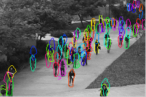

# Computer Vision

This directory contains meta-learning examples and reproductions for common computer vision benchmarks.




## Results (Our Awesome-META+)

**MAML**


**MetaOptNet**


**Reptile**


**Prototypical network**


**Relation Network**


**ANIL**


## Example (Usage)

### MAML

The following files reproduce [MAML](https://arxiv.org/pdf/1703.03400.pdf) on the Omniglot and *mini*-ImageNet datasets.
The FOMAML results can be obtained by setting `first_order=True` in the `MAML` wrapper.
On Omniglot, the CNN results can be obtained by swapping `OmniglotFC` with `OmniglotCNN`.

* `maml_omniglot.py` - MAML on the Omniglot dataset with a fully-connected network.
* `maml_miniimagenet.py` - MAML on the *mini*-ImageNet dataset with the standard convolutional network.
* `maml_cifar.py` - MAML on the Cifar-FS dataset with the standard convolutional network.

Note that the original MAML paper trains with 5 fast adaptation step, but tests with 10 steps.
This implementation only provides the training code.

**Usage**

Manually edit the respective files and run:

~~~shell
python examples/maml_omniglot.py
~~~

or

~~~shell
python examples/maml_miniimagenet.py
~~~

or

~~~shell
python examples/maml_cifar.py
~~~


### Prototypical Networks

The file `protonet_miniimagenet.py` reproduces [Prototypical Networks](https://arxiv.org/pdf/1703.05175.pdf) on the *mini*-ImageNet dataset.

This implementation provides training and testing code.

**Usage**

For 1 shot 5 ways:

~~~shell
python examples/protonet_miniimagenet.py
~~~

For 5 shot 5 ways:

~~~shell
python examples/protonet_miniimagenet.py --shot 5 --train-way 5
~~~

For 1 shot 20 ways:

~~~shell
python examples/protonet_miniimagenet.py --shot 1 --train-way 20
~~~

For 5 shot 20 ways:

~~~shell
python examples/vision/protonet_miniimagenet.py --shot 5 --train-way 20
~~~


### Reptile


**Usage**

Manually edit the above file and run:

~~~shell
python examples/vision/reptile_miniimagenet.py
~~~


### ANIL

The file `anil_fc100.py` and `anil_cifar.py`  implements [ANIL](https://arxiv.org/pdf/1909.09157.pdf) on the FC100 and Cifar-FS dataset.

**Usage**

Manually edit the above file and run:

~~~shell
python examples/vision/anil_fc100.py
~~~

or

~~~shell
python examples/vision/anil_cifar.py
~~~


## General situation

The pretrained weights can be downloaded using `./models/`.

### For example

**LinearBlock**

```python
class LinearBlock(torch.nn.Module):

    def __init__(self, input_size, output_size):
        super(LinearBlock, self).__init__()
        self.relu = torch.nn.ReLU()
        self.normalize = torch.nn.BatchNorm1d(
            output_size,
            affine=True,
            momentum=0.999,
            eps=1e-3,
            track_running_stats=False,
        )
        self.linear = torch.nn.Linear(input_size, output_size)
        fc_init_(self.linear)

    def forward(self, x):
        x = self.linear(x)
        x = self.normalize(x)
        x = self.relu(x)
        return x


class ConvBlock(torch.nn.Module):

    def __init__(self,
                 in_channels,
                 out_channels,
                 kernel_size,
                 max_pool=True,
                 max_pool_factor=1.0):
        super(ConvBlock, self).__init__()
        stride = (int(2 * max_pool_factor), int(2 * max_pool_factor))
        if max_pool:
            self.max_pool = torch.nn.MaxPool2d(
                kernel_size=stride,
                stride=stride,
                ceil_mode=False,
            )
            stride = (1, 1)
        else:
            self.max_pool = lambda x: x
        self.normalize = torch.nn.BatchNorm2d(
            out_channels,
            affine=True,
            # eps=1e-3,
            # momentum=0.999,
            # track_running_stats=False,
        )
        torch.nn.init.uniform_(self.normalize.weight)
        self.relu = torch.nn.ReLU()

        self.conv = torch.nn.Conv2d(
            in_channels,
            out_channels,
            kernel_size,
            stride=stride,
            padding=1,
            bias=True,
        )
        maml_init_(self.conv)

    def forward(self, x):
        x = self.conv(x)
        x = self.normalize(x)
        x = self.relu(x)
        x = self.max_pool(x)
        return x
```


**CNN4**

```python
class CNN4(torch.nn.Module):

    def __init__(
        self,
        output_size,
        hidden_size=64,
        layers=4,
        channels=3,
        max_pool=True,
        embedding_size=None,
    ):
        super(CNN4, self).__init__()
        if embedding_size is None:
            embedding_size = 25 * hidden_size
        self.features = CNN4Backbone(
            hidden_size=hidden_size,
            channels=channels,
            max_pool=max_pool,
            layers=layers,
            max_pool_factor=4 // layers,
        )
        self.classifier = torch.nn.Linear(
            embedding_size,
            output_size,
            bias=True,
        )
        maml_init_(self.classifier)
        self.hidden_size = hidden_size

    def forward(self, x):
        x = self.features(x)
        x = self.classifier(x)
        return x
```


**ResNet12**

```python
class ResNet12(torch.nn.Module):

    def __init__(
        self,
        avg_pool=True,  # Set to False for 16000-dim embeddings
        wider=True,  # True mimics MetaOptNet, False mimics TADAM
        embedding_dropout=0.0,  # dropout for embedding
        dropblock_dropout=0.1,  # dropout for residual layers
        dropblock_size=5,
        channels=3,
    ):
        super(ResNet12Backbone, self).__init__()
        self.inplanes = channels
        block = BasicBlock
        if wider:
            num_filters = [64, 160, 320, 640]
        else:
            num_filters = [64, 128, 256, 512]

        self.layer1 = self._make_layer(
            block,
            num_filters[0],
            stride=2,
            dropblock_dropout=dropblock_dropout,
        )
        self.layer2 = self._make_layer(
            block,
            num_filters[1],
            stride=2,
            dropblock_dropout=dropblock_dropout,
        )
        self.layer3 = self._make_layer(
            block,
            num_filters[2],
            stride=2,
            dropblock_dropout=dropblock_dropout,
            drop_block=True,
            block_size=dropblock_size,
        )
        self.layer4 = self._make_layer(
            block,
            num_filters[3],
            stride=2,
            dropblock_dropout=dropblock_dropout,
            drop_block=True,
            block_size=dropblock_size,
        )
            self.avgpool = nn.AvgPool2d(5, stride=1)

        self.embedding_dropout = embedding_dropout
        self.keep_avg_pool = avg_pool
        self.dropout = nn.Dropout(p=self.embedding_dropout, inplace=False)
        self.dropblock_dropout = dropblock_dropout

        for m in self.modules():
            if isinstance(m, nn.Conv2d):
                nn.init.kaiming_normal_(
                    m.weight,
                    mode='fan_out',
                    nonlinearity='leaky_relu',
                )
            elif isinstance(m, nn.BatchNorm2d):
                nn.init.constant_(m.weight, 1)
                nn.init.constant_(m.bias, 0)

    def _make_layer(
        self,
        block,
        planes,
        stride=1,
        dropblock_dropout=0.0,
        drop_block=False,
        block_size=1,
    ):
        downsample = None
        if stride != 1 or self.inplanes != planes * block.expansion:
            downsample = nn.Sequential(
                nn.Conv2d(self.inplanes, planes * block.expansion,
                          kernel_size=1, stride=1, bias=False),
                nn.BatchNorm2d(planes * block.expansion),
            )
        layers = []
        layers.append(block(
            self.inplanes,
            planes,
            stride,
            downsample,
            dropblock_dropout,
            drop_block,
            block_size)
        )
        self.inplanes = planes * block.expansion
        return nn.Sequential(*layers)

    def forward(self, x):
        x = self.layer1(x)
        x = self.layer2(x)
        x = self.layer3(x)
        x = self.layer4(x)
        x = self.avgpool(x)
        x = self.flatten(x)
        x = self.dropout(x)
        return x
```

for more details, please see: https://github.com/WangJingyao07/MetaLearning-Lab
