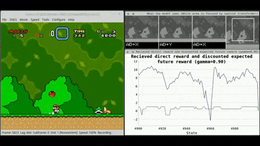
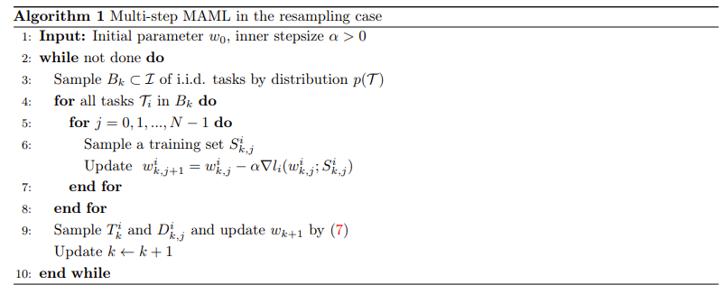

# Reinforcement Learning





## Examples (MAML)


### Dependency

- python: 3.x

- Pytorch: 0.4+

  

### Usage


```bash
python maml_rl.py
```

or 

```bash
python main.py --zero_order --approx_delta=0.3
```


### Improve it

Based Paper:[Multi-Step Model-Agnostic Meta-Learning: Convergence and Improved Algorithms](https://arxiv.org/pdf/2002.07836v1.pdf)



**Rank-One Matrix Factorization**

- matrix_rank_train.py: The training file of rank-one matrix factorization problem
- meta_matrix_rank.py: The meta configure file of rank-one matrix factorization problem
- linear_matrix_rank.py: linear network file

```python
python matrix_rank_train.py --approx_method=zero_order --approx_delta=1e-4
```


**Regression**

- regression_train.py: The training file of regression problem
- meta_regression.py: The meta configure file of regression problem
- MLP.py: MLP network file

```python
python regression_train.py --approx_method=first_approx --approx_delta=1e-7
```
