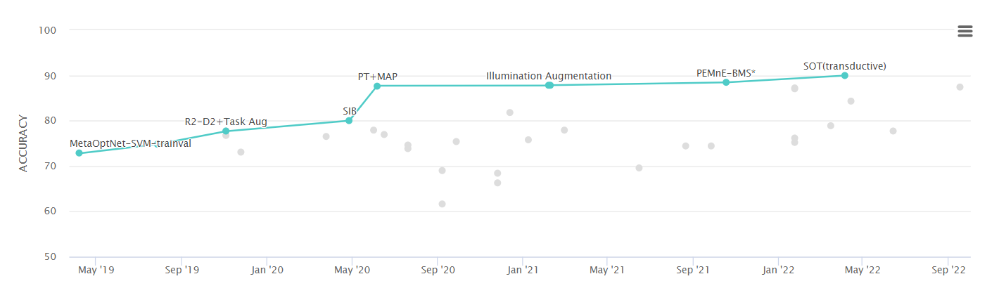

# Datasets

Most popularly used datasets:

* [Omniglot](https://github.com/brendenlake/omniglot) 
* [mini-ImageNet](https://github.com/y2l/mini-imagenet-tools) 
* [ILSVRC](http://image-net.org/challenges/LSVRC/)
* [FGVC aircraft](http://www.robots.ox.ac.uk/~vgg/data/fgvc-aircraft/)
* [Caltech-UCSD Birds-200-2011](http://www.vision.caltech.edu/visipedia/CUB-200-2011.html)
* [CIFAR-FS](https://paperswithcode.com/sota/few-shot-image-classification-on-cifar-fs-5)
* [FC100](https://paperswithcode.com/dataset/fc100)

Check several other datasets by Google [here.](https://github.com/google-research/meta-dataset)

1FAIpQLSeKPfYEttRKN3Lk317cxcNbU454yCTRktXpxMiK_O6PgFq22A/viewform?embedded=true" width="640" height="1200" frameborder="0" marginheight="0" marginwidth="0">Loading…</iframe>

