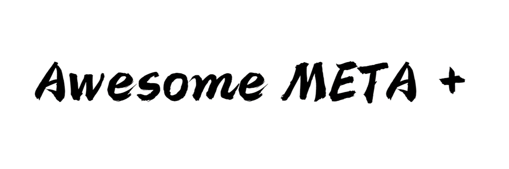

------


---
Written: @Jingyao Wang (UCAS)

---

Awesome-META+ is a software for meta-learning research and practice. 

Awesome-META+ builds on top of PyTorch and Tensorflow to accelerate three aspects of the meta-learning research cycle:

- *Convenient Learning*, complete learning materials are provided for meta learning researchers and newbies
- *Fast prototyping*, essential in letting researchers quickly try new ideas
- *Correct reproducibility*, ensuring that these ideas are evaluated fairly

Awesome-META+ provides multiple meta-learning frameworks, extensive application cases, standardized code modules, comprehensive performance testing, online deployment, etc. to create new algorithms and domains, as well as high-quality implementations of existing algorithms and standardized benchmarks.

The basic services and information provided by this platform are as follows.

We will upload our whitepaper and more details very soon.


## Overview

- **Tutorials**: Usage of Awesome META+ and various settings for framework deployment
- **Documentation**: Models, datasets, benchmarks, optimizers, and standardization
- **Examples**: Framework deployment and application in Computer Vision, Reinforcement Learning, and Optimization
- **Papers**: Materials for research and learning, including papers, blogs, books, libraries, lecture videos etc.
- **Datasets**: Benchmarks of Meta Learning, and performance evaluation on these datasets
- **Community**: Developers of this platform, and research institutions that do well in meta-learning
- **Changelog**: Version update and maintenance log of Awesome META+
- **GitHub**: Code link [GitHub](https://github.com/WangJingyao07/MetaLearning-Lab)


## Installation

The services provided by this platform will be able to be installed in the form of python libraries through **pip** after **January 10, 2023**.

```bash
pip install Awesome-META
```


## Framework List

|                      | Computer Vision | Reinforcement Learning | Optimization | Online |
| :------------------- | :-------------: | :--------------------: | :----------: | :----: |
| MAML                 |        ✅        |           ✅            |      ✅       |   ✅    |
| MetaOptNet           |        ✅        |           ✅            |              |        |
| Reptile              |        ✅        |           ✅            |              |        |
| Prototypical Network |        ✅        |           ✅            |      ✅       |        |
| Relation Network     |        ✅        |           ✅            |      ✅       |        |
| ANIL                 |        ✅        |           ✅            |              |        |
| Meta-SGD             |        ✅        |                        |              |        |
| Meta Dropout         |        ✅        |                        |              |        |
| MT-net               |        ✅        |                        |              |        |
| ES-MAML              |        ✅        |           ✅            |              |        |
| CNAP                 |        ✅        |                        |              |        |
| SNAIL                |        ✅        |                        |              |        |


## Results


### CV

| Method               | Avg rank | ILSVRC (test)         | Omniglot               | Aircraft              | Birds                  | Textures              | QuickDraw              | Fungi                | VGG Flower           | Traffic signs         | MSCOCO                 |
| -------------------- | -------- | --------------------- | ---------------------- | --------------------- | ---------------------- | --------------------- | ---------------------- | -------------------- | -------------------- | --------------------- | ---------------------- |
| k-NN                 | 13.6     | 41.03±1.01&nbsp;(14)  | 37.07±1.15&nbsp;(15)   | 46.81±0.89&nbsp;(14)  | 50.13±1.00&nbsp;(14.5) | 66.36±0.75&nbsp;(12)  | 32.06±1.08&nbsp;(15)   | 36.16±1.02&nbsp;(12) | 83.10±0.68&nbsp;(11) | 44.59±1.19&nbsp;(14)  | 30.38±0.99&nbsp;(14.5) |
| Finetune             | 9.45     | 45.78±1.10&nbsp;(12)  | 60.85±1.58&nbsp;(10.5) | 68.69±1.26&nbsp;(4)   | 57.31±1.26&nbsp;(13)   | 69.05±0.90&nbsp;(8.5) | 42.60±1.17&nbsp;(12.5) | 38.20±1.02&nbsp;(10) | 85.51±0.68&nbsp;(8)  | 66.79±1.31&nbsp;(4)   | 34.86±0.97&nbsp;(12)   |
| Prototypical Network | 9.75     | 50.50±1.08&nbsp;(9.5) | 59.98±1.35&nbsp;(10.5) | 53.10±1.00&nbsp;(9.5) | 68.79±1.01&nbsp;(7.5)  | 66.56±0.83&nbsp;(12)  | 48.96±1.08&nbsp;(10)   | 39.71±1.11&nbsp;(8)  | 85.27±0.77&nbsp;(8)  | 47.12±1.10&nbsp;(13)  | 41.00±1.10&nbsp;(9.5)  |
| MAML                 | 11.25    | 45.51±1.11&nbsp;(12)  | 55.55±1.54&nbsp;(12)   | 56.24±1.11&nbsp;(7.5) | 63.61±1.06&nbsp;(11.5) | 68.04±0.81&nbsp;(8.5) | 43.96±1.29&nbsp;(12.5) | 32.10±1.10&nbsp;(14) | 81.74±0.83&nbsp;(13) | 50.93±1.51&nbsp;(9.5) | 35.30±1.23&nbsp;(12)   |
| Relation Network     | 14.55    | 34.69±1.01&nbsp;(15)  | 45.35±1.36&nbsp;(14)   | 40.73±0.83&nbsp;(15)  | 49.51±1.05&nbsp;(14.5) | 52.97±0.69&nbsp;(15)  | 43.30±1.08&nbsp;(12.5) | 30.55±1.04&nbsp;(15) | 68.76±0.83&nbsp;(15) | 33.67±1.05&nbsp;(15)  | 29.15±1.01&nbsp;(14.5) |
| CNAP                 | 7.75     | 54.80±1.20&nbsp;(5)   | 62.00±1.30&nbsp;(7.5)  | 49.20±0.90&nbsp;(12)  | 66.50±1.00&nbsp;(9.5)  | 71.60±0.70&nbsp;(4.5) | 56.60±1.00&nbsp;(6)    | 37.50±1.20&nbsp;(10) | 82.10±0.90&nbsp;(11) | 63.10±1.10&nbsp;(5.5) | 45.80±1.00&nbsp;(6.5)  |


### RL

cite from [GitHub](https://github.com/navneet-nmk/Hierarchical-Meta-Reinforcement-Learning)


## Changelog

A human-readable changelog is available in the Changelog file.


## Citation

Comming soon......


## Send Us Feedback!

Our library is open source for research purposes, and we want to improve it! So let us know (create a new GitHub issue or pull request, email us, etc.) if you...

1. Find/fix any bug (in functionality or speed) or know how to speed up or improve any part of Awesome META+.
2. Want to add/show some cool functionality/demo/project made on top of Awesome META+. We can add your project link to our Community-based Projects section or even integrate it with Awesome META+!


### Acknowledgements & Friends

1. [Learn2learn](https://github.com/learnables/learn2learn) is similar library, provides standardized samples and focuses on the simple form of building a meta-learning framework
3. [higher](https://github.com/facebookresearch/higher) is a PyTorch library that enables differentiating through optimization inner-loops. While they monkey-patch `nn.Module` to be stateless, learn2learn retains the stateful PyTorch look-and-feel. For more information, refer to [their ArXiv paper](https://arxiv.org/abs/1910.01727).
4. We are thankful to the following open-source implementations which helped guide the design of Awesome META+:
   - learnables's [learn2learn](https://github.com/learnables/learn2learn)
   - Tristan Deleu's [pytorch-maml-rl](https://github.com/tristandeleu/pytorch-maml-rl)
   - Maracver's [Relation-Networks](https://github.com/msracver/Relation-Networks-for-Object-Detection)
   - Kwonjoon Lee's [MetaOptNet](https://github.com/kjunelee/MetaOptNet)


## License

Awesome META+ is freely available for free non-commercial use, and may be redistributed under these conditions.

